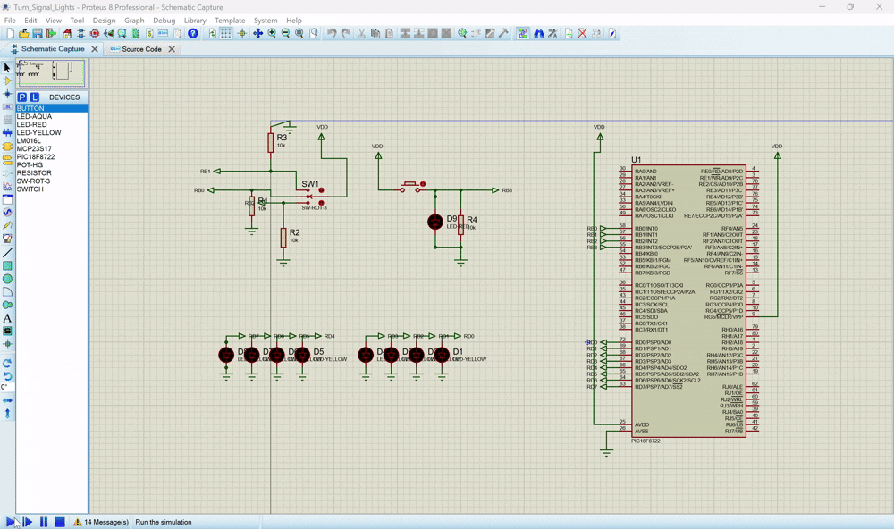

# Turn Lights Prototype - PIC18F8722

## Overview
This project implements a turn signal light prototype using a PIC18F8722 microcontroller, simulated in Proteus. The system controls LED patterns based on input signals, demonstrating basic automotive turn signal functionality.



## Hardware Components
- Microcontroller: PIC18F8722
- LEDs connected to PORTD
- Input switches connected to PORTB
- 4MHz oscillator configuration

## Features
- Three distinct LED lighting patterns:
  - `LED1()`: Right turn signal (sequential right-side activation)
  - `LED2()`: Left turn signal (sequential left-side activation)
  - `LED4()`: Hazard lights (symmetric outward activation)
- Input-controlled operation via PORTB
- Adjustable timing via `period` variable (default 200ms)

## Usage
1. Configure inputs on PORTB:
   - Right turn: `0b00000010`
   - Left turn: `0b00000100`
   - Hazard lights: Various patterns including `0b00001100`, `0b00001010`, etc.

2. The system will automatically display the corresponding LED pattern:
   - Right turn: LEDs activate right-to-left
   - Left turn: LEDs activate left-to-right
   - Hazard: LEDs activate symmetrically outward

## Simulation Notes
- Designed for Proteus simulation
- Uses 4MHz clock speed (HS oscillator)
- All PORTD pins drive LED outputs
- The code can be found [Here](Code)

## Customization
Adjust the `period` variable to change the timing of LED sequences:
```c
int period = 200; // Change this value (in milliseconds) to alter timing
```

## Requirements
- MPLAB XC8 compiler
- Proteus simulation environment
- PIC18F8722 microcontroller model
